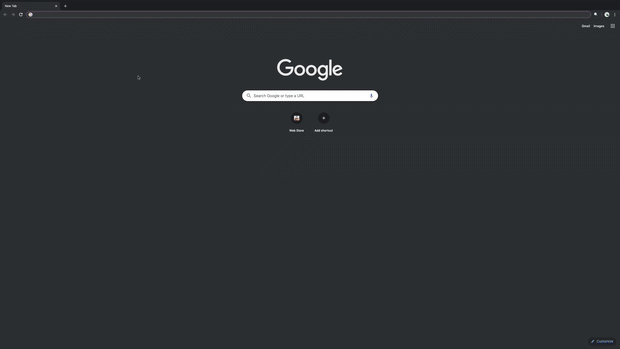

# WhitakersExtension

A Chrome Extension that acts as an aid for Latin Education and Translation

Using Whitaker's Words, the database powered by the Latin Department at Notre Dame, I developed this Chrome Extension as an effort to showcase our interest in Latin education.

## How To Use The Extension

1) Download the source code using the green button above to a location on your computer
2) Go to chrome://extensions and turn on developer mode
3) Click "Load unpacked" and select the folder you downloaded
4) Enable the extension and try it out!
